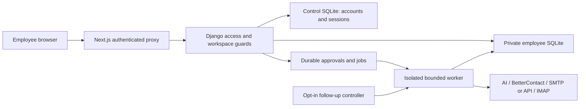

# LeadZen production readiness audit — 2 October 2026

Local verification passed after the fixes below. Production release gates remain open: real providers have not been exercised, the new follow-up service is disabled, and the deployed application still has the older baseline. Ten repetitions establish repeatability for the covered scenarios; they cannot establish that every possible input, button state, outage or delivery outcome is perfect.

## Scope and preservation

Repository: /Users/ashishdikonda/Desktop/Openoutreach/OpenOutreach, branch main. Requirements: the user’s pasted total plan and [docs/new-chat-handoff-2026-10-02.md](/Users/ashishdikonda/Desktop/Openoutreach/OpenOutreach/docs/new-chat-handoff-2026-10-02.md). The handoff supplied context; the current audit-and-fix request authorized local changes. The user separately chose **Implement automatic follow-ups after campaign approval**.

All pre-existing uncommitted and untracked work was retained. There was no reset, stash, commit, push, deployment, real email, paid lookup or live AI call. Migrations ran only against disposable test databases. Production credentials, owner-only access files and real databases were not read or modified. Historical openoutreach source deletions were preserved.

The inventory contains **247 file records**: 132 production source files (131 inspected, one CSS file with an explicit partial scope), 17 migrations, 27 configuration files, 41 test/fixture files, 18 documentation files, one tooling file, four generated files, four assets and three audit outputs. There are 199 inspected records, seven new inspected/executed test files, 24 existing test files executed with exhaustive manual assertion review excluded, one partial CSS inspection, 13 exclusions and three generated audit outputs.

The file-by-file disposition and hashes are in [docs/production-readiness-inventory-2026-10-02.json](/Users/ashishdikonda/Desktop/Openoutreach/OpenOutreach/docs/production-readiness-inventory-2026-10-02.json); sanitized verification totals and named UI scenarios are in [docs/production-readiness-results-2026-10-02.json](/Users/ashishdikonda/Desktop/Openoutreach/OpenOutreach/docs/production-readiness-results-2026-10-02.json). Source modules were inspected in their caller/guard/test context. CSS received focused layout, focus and responsive inspection plus browser checks. Existing tests were executed; files without exhaustive assertion-by-assertion review are explicitly identified. Generated files, binaries, private environment files, vendor trees and historical deployment/legal material have explicit exclusions. This is not a legal clearance or exhaustive penetration test.

## Architecture assessment

The existing architecture fits a private internal tool with a persistent VM and a modest employee count. Next.js 16.3.8 / React 19 / TypeScript renders the dashboard and proxies allowlisted requests. Django authenticates the service token and live employee session, derives the workspace from the actor, and stores employee data and encrypted credentials in private SQLite databases. A separate control database holds accounts and revocable sessions. The installed finder and sender are openoutfind 0.1.10 and openoutsend 0.1.32; their source interfaces remain intact.

Browser credentials are distinct from sending identity. Secrets stay encrypted on the backend; saved secrets are not returned for reveal. External calls retain endpoint allowlists, pinned public connections, TLS validation, bounded timeouts and provider restrictions. Workers recheck access and exact approvals immediately before effects. Claims, request IDs, workspace locks and uncertain-delivery holds prevent blind duplicate sends or purchases. Dashboard metrics and Activity use saved facts. These properties were verified through local source inspection and synthetic regression tests.

SQLite and serial bounded workers are reasonable for the current internal deployment. There is no evidence here for large-team throughput, sustained provider outages or multi-host worker operation. A larger deployment needs measured load and recovery exercises before changing this architecture.

## Plan comparison

Local pass means implemented behavior and its listed synthetic tests passed. It does not mean a live provider account was verified.

| Requested flow | Local result and evidence | Material qualification |
|---|---|---|
| Setup AI and Test connection | Six-step wizard, configurable provider/model/key/base URL; 43 backend wizard cases and UI step/test controls. [leadzen/setup_wizard.py](/Users/ashishdikonda/Desktop/Openoutreach/OpenOutreach/leadzen/setup_wizard.py) | Actual model/key inference remains untested. |
| Setup BetterContact and credits | Explicit test, saved balance, free profile discovery vs optional paid enrichment, unknown usage stays unknown. 15 connection and 33 live-discovery cases. | Balance and cost shown in previews are synthetic fixtures; live credit balance was not checked. |
| About You | Name/email/country validation, identity separate from login, email-shaped names rejected; draft persists per employee. | No global model or identity was hard-coded. |
| Mailbox setup | SMTP implicit TLS 465, STARTTLS 587/2525 and independent IMAP settings; explicit authentication tests and masked saved secrets. 20 transport cases. | No SMTP delivery or real IMAP sync was attempted. API connection success is distinguished from delivery. |
| Product and structured audience | Product context, industry/country/size/roles/seniority/exclusions, canonical preview, Edit/Looks good, resume and receipt invalidation. | Target edits do not retroactively requalify old records. |
| Dashboard | Stored found/qualified/email/contacted/replied counts, checked credits, target and recent decisions; browser navigation repeated ten times. | Imported contacts contribute to outreach totals; they are not automatically AI-qualified. |
| Find Leads | Count 1–25, default 3, free mode default, explicit maximum email-credit estimate before Start. | AI usage is separate from BetterContact email credits. |
| Live discovery | Persisted counts, candidate reasons, progress and safe links; Pause/Resume/Stop and partial completion; UI controls tested. | External search timing/outages were mocked. |
| Review Leads and Find Emails | Filters/search/pagination/detail/qualification links, separate selected-profile cost confirmation and Cancel; uncertainty prevents replay. 22 CRM cases plus UI controls. | Catch-all addresses and provider-reported usage are distinguished; one-credit copy is an estimate for the normal verified-email path. |
| Campaign sequence | New campaigns default to initial + two follow-ups, after 3 and 5 further working days; offer, signature and HTTPS booking link. 31 campaign cases. | Weekends are excluded; public holidays are not modeled. Old calendar-day campaigns retain their saved behavior. |
| AI email preview | Regenerate, edit, approve each exact message, then final Yes/No; failed confirmation stays visible; content/identity changes invalidate approval. 43 reviewed-outreach cases plus UI controls. | AI-assisted initial outreach creates reviewed messages, not an automatic campaign sequence. Use Campaign to approve a sequence. |
| Start and progress | Exact recipient/content approval, bounded request, duplicate protection, pacing/window/capacity/access checks, saved per-message acceptance and uncertainty. | Manual sends retain the installed sender’s 8 AM–8 PM weekday window, differing from the plan’s 9 AM–5 PM example. |
| Inbox and suggested replies | Stored conversation view, original mailbox/thread, latest reply, edit/approve/send, suppression disables replying, duplicate parent reply blocked. | Sync/classification is an explicit action. No real customer reply was fetched. |
| Automatic follow-ups | Implemented after exact campaign approval; selected recipients only, one-year expiry, saved timezone 9 AM–5 PM weekdays, reply/opt-out/stop guards, no initial auto-send. 40 new backend cases. [docs/automatic-followups.md](/Users/ashishdikonda/Desktop/Openoutreach/OpenOutreach/docs/automatic-followups.md) | Service flag defaults off. It was not installed, enabled or run against real credentials. |
| Lead timeline / Stop Sequence | Accepted initial history, scheduled follow-ups and terminal stop/reply/suppression; 15 timeline cases and UI controls. | Existing paused/uncertain states remain visible; Stop cannot recall provider-accepted mail. |
| Do Not Contact | Search/pagination/reasons/dates, Add/Cancel; suppression is terminal and rechecked before send/import. | Existing history is retained after contact soft deletion. |
| Activity / Developer Logs | Readable events by default, explicit Developer Logs with bounded redacted output, Refresh/Close. 12 activity cases and ten UI repetitions. | No default raw-terminal view was added. |
| Settings / Backup Database | AI, discovery, identity, mailbox, target, signature, booking link, saved data path; Edit/Save/Cancel/Test and backup controls. 13 workspace-settings cases. | Download is one employee database; server recovery also needs control DB, all workspaces, encryption key and environment. |
| Entry point | Django localhost:8000 supplies API/entry behavior; the actual employee UI is a separate Next.js dashboard. | Audit preview is localhost:3001 because other local applications use their own ports. The plan’s single-process localhost:8000 UI is not this deployment shape. |

## Changes applied

| ID / severity | File and defect or missing behavior | Applied change / classification | Verification |
|---|---|---|---|
| F01 High | [leadzen/campaigns.py:347](/Users/ashishdikonda/Desktop/Openoutreach/OpenOutreach/leadzen/campaigns.py:347): a reply or Stop could arrive after a recipient claim; failure handling could overwrite a terminal stop. | Recheck inbound replies at the transport boundary and preserve stopped status on failure. Authorized local correctness fix. | Late-reply/stop race regressions and all ten backend passes. |
| F02 High | [leadzen/web.py:329](/Users/ashishdikonda/Desktop/Openoutreach/OpenOutreach/leadzen/web.py:329): abandoned queued/running send jobs could indefinitely block new work. | Expire jobs older than 20 minutes, preserve ambiguous recipient/draft attempts as review, fail saved reviews, never replay. Authorized local correctness fix. | Crash/uncertain recovery regression and ten backend passes. |
| F03 High feature gap | [leadzen/followups.py:29](/Users/ashishdikonda/Desktop/Openoutreach/OpenOutreach/leadzen/followups.py:29), [leadzen/scheduler.py:12](/Users/ashishdikonda/Desktop/Openoutreach/OpenOutreach/leadzen/scheduler.py:12): campaign follow-ups required manual runs. | Durable exact-sequence recipient approval, guard fingerprints, expiry, isolated locked worker passes, reply/opt-out checks and 9–5 saved-timezone window. Escalate scope was explicitly authorized by the user; additive migration 0013 and disabled service template remain local. | 40 new cases, repeated as part of the full backend suite ten times; UI opt-in/final-confirmation controls. |
| F04 High | [dashboard/lib/auth.ts:39](/Users/ashishdikonda/Desktop/Openoutreach/OpenOutreach/dashboard/lib/auth.ts:39): valid standalone HTTPS submissions behind a reverse proxy were rejected against Next.js’s internal URL. | Optional server-only LEADZEN_DASHBOARD_PUBLIC_URL validates an explicit exact public origin; invalid configuration fails closed, forwarded-host input cannot select trust. Authorized local auth repair; existing unset Vercel behavior retained. | Seven origin scenarios ×10; authenticated optimized HTTPS flow ×10. |
| F05 Medium | [leadzen/campaigns.py:374](/Users/ashishdikonda/Desktop/Openoutreach/OpenOutreach/leadzen/campaigns.py:374): daily attempt counting used a UTC date boundary. | Use the sender’s local-midnight helper so attempts and mailbox daily limits agree. Authorized local correctness fix. | Campaign capacity regressions and ten full backend passes. |
| F06 Medium | [leadzen/accounts/views.py:213](/Users/ashishdikonda/Desktop/Openoutreach/OpenOutreach/leadzen/accounts/views.py:213): legacy onboarding did not consistently validate a booking URL before workspace initialization/save. | Reuse the existing HTTPS booking-link validator before any persisted setup change. Authorized local validation fix. | Onboarding/settings regressions, ten full backend passes and HTTP flows. |
| F07 Medium | [dashboard/components/outreach-review.tsx:8](/Users/ashishdikonda/Desktop/Openoutreach/OpenOutreach/dashboard/components/outreach-review.tsx:8): final-send errors were lost during refresh. [dashboard/components/campaigns.tsx:121](/Users/ashishdikonda/Desktop/Openoutreach/OpenOutreach/dashboard/components/campaigns.tsx:121): recovered load errors could linger. | Keep final confirmation error visible; separate load and action errors, clear recovered load failures. Auto-fix. | Dedicated failure/retry control scenarios ×10. |
| F08 Medium | [dashboard/components/contacts.tsx:73](/Users/ashishdikonda/Desktop/Openoutreach/OpenOutreach/dashboard/components/contacts.tsx:73), [dashboard/components/admin.tsx:18](/Users/ashishdikonda/Desktop/Openoutreach/OpenOutreach/dashboard/components/admin.tsx:18), [dashboard/lib/use-setup-wizard.ts:44](/Users/ashishdikonda/Desktop/Openoutreach/OpenOutreach/dashboard/lib/use-setup-wizard.ts:44): same-tick repeated submissions could bypass render-time busy flags. | Ref guards around submissions with finally release; cancellation/close controls disabled during writes; contact input limits match models. Auto-fix. | Exact-once/double-click/form control scenarios ×10. |
| F09 Low | [dashboard/components/tour.tsx:21](/Users/ashishdikonda/Desktop/Openoutreach/OpenOutreach/dashboard/components/tour.tsx:21): tour described an obsolete follow-up count and could go Back during completion. | Copy explains up to two reviewed follow-ups and optional automatic service; Back disabled while finishing. Auto-fix. | Tour/control scenarios ×10. |
| F10 Verification gap | [dashboard/vitest.config.mts](/Users/ashishdikonda/Desktop/Openoutreach/OpenOutreach/dashboard/vitest.config.mts), [.github/workflows/tests.yml](/Users/ashishdikonda/Desktop/Openoutreach/OpenOutreach/.github/workflows/tests.yml): dashboard had no durable control-test gate. | Add Vitest/Testing Library scenarios with ten passes and a dashboard CI job for install/type check/tests/build. Authorized local tooling change. | 640 test executions, TypeScript and optimized build passed; GitHub workflow itself was not run. |
| F11 Operations gap | [compose/leadzen/deploy-accounts.sh:10](/Users/ashishdikonda/Desktop/Openoutreach/OpenOutreach/compose/leadzen/deploy-accounts.sh:10): release worker quiescence did not cover the new follow-up controller. | Include controller stop/backup and workspace worker checks; retain recovery context and leave follow-ups stopped after release. Authorized local support for requested feature. | bash syntax check only; no systemd/deployment command executed. |

## Verification results

| Check | Final result | Scope |
|---|---|---|
| Backend full suite | **409 passed in each of ten consecutive passes = 4,090 executions**, zero failures/errors/skips | Disposable Django/SQLite tests, fake transports/providers. Backend source was stable throughout these passes. |
| Dashboard suite | **64 scenarios ×10 = 640 passing executions** | 57 UI/control scenarios and 7 origin scenarios. Component APIs/network/navigation mocked; this is not 640 real-provider browser actions. |
| Local dev HTTP flow | **10/10 passed** | Next.js → Django → real disposable employee SQLite, local invitation catcher, approval/isolation/revocation/logout; campaign sending deliberately rejected. |
| Optimized production HTTPS flow | **10/10 passed** | Built standalone Next.js → validating TLS → Django → fresh disposable SQLite, secure cookies, foreign-origin rejection and full HTTP lifecycle. |
| Browser workspace navigation | **90/90 passed** | Nine workspace pages, ten passes, expected rendered heading awaited after actual navigation. |
| Mobile navigation | **10/10 open/close cycles, 20 actions passed** | 390px viewport, no horizontal overflow; temporary viewport override reset. |
| TypeScript | Passed | npm run lint is tsc --noEmit; the project has no separate ESLint gate. |
| Optimized dashboard build | Passed | All 24 generated pages and authenticated route build; rebuilt after the origin fix. |
| Django check registry | Zero issues | django.core.checks.run_checks with disposable configuration. The project overrides the CLI check verb, so that verb is not a safe general framework check. |
| Model/migration drift | No changes | makemigrations --check --dry-run for leadzen_config and leadzen_accounts, including new additive 0013. Real DBs untouched. |
| Release script | Syntax passed | bash -n only. |
| npm production dependencies | Zero known vulnerabilities reported | npm audit --omit=dev; dev/test dependencies excluded. |
| Python dependencies | Zero known vulnerabilities reported for 102 resolved packages | pip-audit against the local Python 3.12 environment; local leadzen 0.1.0 skipped because it is not on PyPI. |
| React Doctor full tree | **72/100, no errors, 16 warnings across 91 scanned files** | Maintainability/complexity, setup effect and locale formatting warnings reviewed below. Diff-only 100/100 was not substituted for the full tree. |
| Working tree whitespace | Passed | git diff --check; all user changes preserved. |

Raw local evidence is under /tmp/leadzen-production-audit-20261002, including backend-01.xml through backend-10.xml, ui-controls.json, browser-navigation.json, mobile-navigation.json, http-01.log through http-10.log, production-https-01.log through production-https-10.log, dashboard-build.log and dependency/React Doctor reports. Temporary logs may expire; the repository JSON results retain sanitized counts and evidence hashes.

Baseline: the backend started at 369 passing cases. New automatic-follow-up/recovery coverage adds 40. No backend baseline failure was hidden. An early repeated run overlapped code editing and was discarded; the final ten passes ran after backend edits stopped. Early UI test drafts had fixture/locator problems and were corrected before the final gate. The production HTTPS flow first reproduced the invalid-origin rejection; the canonical-origin fix and subsequent ten passes establish the final result. The new origin-test file initially could not resolve Next.js’s server-only marker in Vitest; a test-only alias to Next.js’s compiled empty marker fixed test setup. No failed or premature browser snapshot was counted as a passing navigation.

## Remaining findings and release gates

### High: live integration and deployed version still unverified

Locations: [leadzen/transports.py:183](/Users/ashishdikonda/Desktop/Openoutreach/OpenOutreach/leadzen/transports.py:183), [leadzen/ai.py](/Users/ashishdikonda/Desktop/Openoutreach/OpenOutreach/leadzen/ai.py), [leadzen/discovery.py](/Users/ashishdikonda/Desktop/Openoutreach/OpenOutreach/leadzen/discovery.py), [docs/deployment.md](/Users/ashishdikonda/Desktop/Openoutreach/OpenOutreach/docs/deployment.md). Impact: correct local state transitions do not establish valid live credentials, mailbox coverage, model outputs, billable-credit behavior, provider acceptance, inbox placement or matching production schema. Classification: **Escalate — requires fresh deployment/provider/send approval**. The recommendation is a bounded staging pilot with an approved internal recipient and explicit provider budget, followed by matching-code and every-workspace migration/backup checks. No production-readiness guarantee is made.

### Medium: follow-up service availability is configuration, not health

Locations: [leadzen/scheduler.py:30](/Users/ashishdikonda/Desktop/Openoutreach/OpenOutreach/leadzen/scheduler.py:30), [leadzen/followups.py:67](/Users/ashishdikonda/Desktop/Openoutreach/OpenOutreach/leadzen/followups.py:67), [dashboard/components/campaign-send-review.tsx:47](/Users/ashishdikonda/Desktop/Openoutreach/OpenOutreach/dashboard/components/campaign-send-review.tsx:47). The flag does not prove the controller is running; there is no durable heartbeat or external alert. Worker passes are serial, capped at 25 due messages per campaign and 180 seconds per workspace. Failure notices can remain until a sequence is reviewed again, even after a transient sync recovers. Classification: **Recommend**. Before sustained unattended operation, add a service-health signal/alert and exercise crashes, provider latency and due-queue drainage in staging. Delivery uncertainty already fails closed and is not automatically retried.

### Medium: the requested sending experience has two remaining scope differences

Locations: [leadzen/outreach.py:224](/Users/ashishdikonda/Desktop/Openoutreach/OpenOutreach/leadzen/outreach.py:224), [leadzen/campaigns.py:347](/Users/ashishdikonda/Desktop/Openoutreach/OpenOutreach/leadzen/campaigns.py:347), [docs/automatic-followups.md](/Users/ashishdikonda/Desktop/Openoutreach/OpenOutreach/docs/automatic-followups.md). Automatic campaign follow-ups follow the requested 9–5 window; manually approved initial/due runs retain 8–20. AI-reviewed initial messages do not create a Campaign sequence. Classification: **Recommend — product behavior decision**. Align configurable hours and define whether an AI-reviewed initial should become a campaign before claiming the entire sample flow is identical. Existing UI states that reviewed initial outreach schedules no automatic follow-up.

### Medium: full server recovery and load have not been rehearsed

Locations: [leadzen/workspace_settings.py](/Users/ashishdikonda/Desktop/Openoutreach/OpenOutreach/leadzen/workspace_settings.py), [compose/leadzen/deploy-accounts.sh](/Users/ashishdikonda/Desktop/Openoutreach/OpenOutreach/compose/leadzen/deploy-accounts.sh). Employee backup tests passed, including a consistent local database export, but a server restore also needs the control database, all workspaces, stable encryption key and matching environment/source/services. Docker image/systemd execution, release rollback and simultaneous employee/provider latency load were not run. Classification: **Recommend/Escalate for live operations**. Use isolated staging data for a complete restore and concurrency exercise before an approved release.

### Low: React maintenance warnings remain

Locations: [dashboard/components/contacts.tsx:59](/Users/ashishdikonda/Desktop/Openoutreach/OpenOutreach/dashboard/components/contacts.tsx:59), [dashboard/components/campaigns.tsx:107](/Users/ashishdikonda/Desktop/Openoutreach/OpenOutreach/dashboard/components/campaigns.tsx:107), [dashboard/components/campaign-send-review.tsx:9](/Users/ashishdikonda/Desktop/Openoutreach/OpenOutreach/dashboard/components/campaign-send-review.tsx:9), [dashboard/components/chat.tsx:258](/Users/ashishdikonda/Desktop/Openoutreach/OpenOutreach/dashboard/components/chat.tsx:258), [dashboard/components/admin.tsx:238](/Users/ashishdikonda/Desktop/Openoutreach/OpenOutreach/dashboard/components/admin.tsx:238) and the full React Doctor report. Large components, control-flow complexity and duplicated admin JSX are credible maintenance concerns (high confidence), with no reproduced functional failure from these warnings. Setup’s browser effect reads a fragment invitation token before fetching; it cannot be moved blindly to a server request (context-dependent diagnostic). Locale/timezone formatting warnings are useful hypotheses, but no hydration failure was observed in the tested viewports (medium confidence). Classification: **Recommend**. Extract focused components and choose deterministic display formatting when doing related product work; no diagnostic suppression or broad rewrite was added.

No confirmed critical cross-workspace leak or bypass was found in the covered paths. This statement is limited by the explicit file exclusions, mocked providers and lack of a penetration/load test.

## Release boundary and next concrete work

1. Resolve the hours/AI-initial-to-campaign product differences if exact parity with the sample flow is required.
2. Add scheduler health visibility and complete isolated load/crash/full-restore exercises before sustained unattended use.
3. After fresh approval, perform a narrowly budgeted real-provider/internal-mailbox staging pilot.
4. After a separate release approval, back up matching control/workspace data and encryption environment, quiesce all workers, migrate every initialized workspace through 0013, release matching API/dashboard code, and verify isolation and rollback. Enable the automatic service only for reviewed scope after checking delivery holds.

The normal synthetic preview was restored at http://localhost:3001 with the API at http://127.0.0.1:8000 and disposable data under /tmp/leadzen-preview.4jN21Q. Temporary TLS listeners were stopped; no system CA was installed and certificate validation was never disabled. Final browser proof is /tmp/leadzen-production-audit-20261002/dashboard-restored.png. [docs/automatic-followups.md](/Users/ashishdikonda/Desktop/Openoutreach/OpenOutreach/docs/automatic-followups.md) records the local implementation and safe activation boundary.
